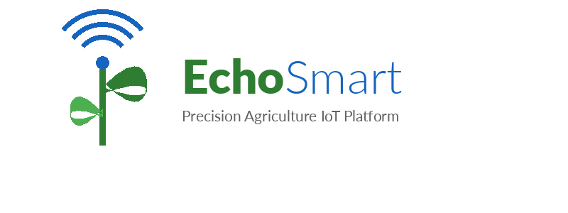

# 🌱 EchoSmart — Invernadero Inteligente

**Plataforma IoT para invernaderos inteligentes con monitoreo ambiental en tiempo real.**

[](https://github.com/Uaemextop/echosmart/actions/workflows/ci.yml)
[](/docs/README.md)
[](LICENSE)
[](web/index.html)

<p align="center">
  
</p>

---

## Descripción

EchoSmart es un **sistema de invernadero inteligente** que permite monitorear y controlar las condiciones ambientales de cultivos en ambientes protegidos. Mediante una arquitectura **edge-to-cloud** de tres capas — Gateway (Raspberry Pi), Backend Cloud (FastAPI) y Frontend (React) — la plataforma recopila datos de múltiples sensores, genera alertas en tiempo real, produce reportes automatizados y permite el control remoto de actuadores (riego, ventilación, iluminación), todo con soporte multi-tenant.

### ¿Para quién es EchoSmart?

- 🌿 **Agrónomos** que necesitan monitorear condiciones del invernadero en tiempo real.
- 🏭 **Operadores** que gestionan sistemas de riego, ventilación e iluminación.
- 📊 **Investigadores** que analizan datos históricos para optimizar cultivos.
- 🏢 **Empresas agrícolas** que requieren gestión multi-invernadero con trazabilidad.

### Características Principales

- **🌡️ Monitoreo en tiempo real** — Lectura continua de temperatura, humedad, luminosidad, humedad de suelo y CO₂ con actualización instantánea vía WebSocket.
- **🔌 Hot-plug de sensores** — Los dispositivos se auto-descubren y configuran al conectarse al gateway mediante SSDP.
- **🚨 Alertas configurables** — Reglas flexibles con evaluación local en el gateway y redundancia en la nube; notificaciones por email, SMS, push y webhooks.
- **📄 Reportes automatizados** — Generación asincrónica de reportes PDF y Excel con gráficas embebidas.
- **🏢 Multi-tenancy** — Aislamiento completo de datos, branding personalizado y RBAC.
- **⚡ Edge computing** — El gateway opera de forma autónoma con caché local, garantizando continuidad ante pérdida de conectividad.
- **💧 Control de actuadores** — Encendido/apagado remoto de riego, ventilación e iluminación (roadmap).
- **🤖 Analítica predictiva** — Modelos de ML para predicción de temperatura y detección de anomalías (roadmap).

---

## Rangos Óptimos para Invernadero

| Variable | Rango Óptimo | Alerta Baja | Alerta Alta | Fuente |
|----------|-------------|-------------|-------------|--------|
| Temperatura | 18°C – 28°C | < 10°C | > 35°C | FAO / SAGARPA |
| Humedad Relativa | 60% – 80% | < 40% | > 90% | FAO |
| Luminosidad | 10,000 – 30,000 lux | < 5,000 lux | > 50,000 lux | FAO |
| CO₂ | 400 – 1,000 ppm | < 300 ppm | > 1,500 ppm | ASHRAE |
| Humedad del Suelo | 50% – 80% | < 30% | > 95% | INIFAP |

---

## Stack Tecnológico

| Capa | Tecnología |
|------|-----------|
| **Gateway (Edge)** | Raspberry Pi 4B · Python 3.9+ · SQLite · Mosquitto MQTT |
| **Backend (Cloud)** | FastAPI · PostgreSQL 14+ · InfluxDB 2.7+ · Redis 7+ · Docker |
| **Frontend (Web)** | React 18+ · Redux Toolkit · Recharts · Material-UI / Tailwind CSS |
| **Móvil** | React Native (Expo) · iOS y Android |
| **CI/CD** | GitHub Actions · Docker · Kubernetes |

---

## Inicio Rápido

```bash
# 1. Clonar el repositorio
git clone https://github.com/Uaemextop/echosmart.git
cd echosmart

# 2. Levantar infraestructura
docker-compose up -d

# 3. Configurar y ejecutar el backend
cd backend
python -m venv venv && source venv/bin/activate
pip install -r requirements.txt
uvicorn main:app --reload

# 4. Configurar y ejecutar el frontend
cd ../frontend
npm install && npm run dev
```

Para instrucciones detalladas, consultar la guía de [Primeros Pasos](docs/getting-started.md).

---

## Sensores Soportados

| Sensor | Medición | Protocolo | Rango |
|--------|----------|-----------|-------|
| DS18B20 | Temperatura | 1-Wire | −55 °C a +125 °C (±0.5 °C) |
| DHT22 | Temperatura + Humedad | GPIO | −40 °C a +80 °C · 0-100 % HR |
| BH1750 | Luminosidad | I2C | 0–65 535 lux |
| Soil Moisture | Humedad de suelo | ADC (ADS1115) | Analógico 0–1023 |
| MHZ-19C | CO₂ | UART | 0–5000 ppm |

Consultar el [Roadmap de Features](docs/features-roadmap.md) para los sensores futuros (BME280, pH, EC, caudal, etc.).

---

## Arquitectura

```
┌─────────────────┐     ┌─────────────────────────┐     ┌──────────────────┐
│   Sensores      │     │   Gateway (Edge)        │     │   Cloud Backend  │
│  DS18B20        │────▶│   Raspberry Pi 4B       │────▶│   FastAPI        │
│  DHT22          │     │   Python · SQLite       │     │   PostgreSQL     │
│  BH1750         │     │   MQTT · Alert Engine   │     │   InfluxDB       │
│  Soil Moisture  │     │                         │     │   Redis          │
│  MHZ-19C        │     └─────────────────────────┘     └────────┬─────────┘
└─────────────────┘                                              │
                                                        ┌────────▼─────────┐
                                                        │   Frontend       │
                                                        │   React · Redux  │
                                                        │   WebSocket      │
                                                        └──────────────────┘
```

---

## Estructura del Proyecto

```
echosmart/
├── web/              # Página web (landing page + dashboard)
├── backend/          # API FastAPI, servicios, modelos
├── frontend/         # Aplicación web React
├── gateway/          # Software del gateway Raspberry Pi
├── mobile/           # App móvil React Native (Expo)
├── infra/            # Docker, Kubernetes, Nginx, scripts
├── assets/           # Logo, iconos, favicon y branding
├── docs/             # Documentación técnica (26 documentos)
│   ├── bocetos/      # Wireframes de las páginas (PNG)
│   └── *.md          # Documentación en Markdown
├── .github/          # Workflows CI/CD, templates de issues/PR
├── docker-compose.yml
├── LICENSE
├── CHANGELOG.md
└── README.md
```

Para la estructura detallada de cada capa, consultar [Estructura del Proyecto](docs/project-structure.md).

---

## Documentación

La documentación completa del proyecto se encuentra en el directorio [`docs/`](docs/README.md).

### Inicio y Funcionalidad

| Documento | Descripción |
|-----------|-------------|
| [Índice de Documentación](docs/README.md) | Punto de entrada y navegación |
| [Primeros Pasos](docs/getting-started.md) | Instalación y configuración |
| [Funcionalidad de la Aplicación](docs/app-functionality.md) | Funciones del sistema |
| [Estructura del Proyecto](docs/project-structure.md) | Carpetas, módulos y dependencias |
| [Funcionalidades y Roadmap de Features](docs/features-roadmap.md) | Features actuales y futuras |

### Arquitectura y Diseño

| Documento | Descripción |
|-----------|-------------|
| [Arquitectura de Software](docs/architecture.md) | Diseño de la arquitectura de 3 capas |
| [Diagramas, Bocetos y Esquemas](docs/diagramas-esquemas.md) | Diagramas Mermaid: arquitectura, ER, flujos, MQTT, gateway |
| [Protocolos de Comunicación](docs/communication-protocols.md) | MQTT, 1-Wire, I2C, UART, HTTP, WebSocket |
| [Esquema de Base de Datos](docs/database-schema.md) | PostgreSQL, InfluxDB, Redis, SQLite |
| [Roadmap Ejecutivo](docs/roadmap.md) | Fases, milestones y KPIs |

### Backend y API

| Documento | Descripción |
|-----------|-------------|
| [Integración Backend](docs/backend-integration.md) | Flujos de datos E2E |
| [Funciones del Backend](docs/backend-functions.md) | Servicios y funciones (FastAPI) |
| [API, Testing y DevOps](docs/api-testing-devops.md) | REST API, testing y CI/CD |

### Gateway y Hardware

| Documento | Descripción |
|-----------|-------------|
| [Configuración de Raspberry Pi OS](docs/raspberry-pi-setup.md) | Instalación del SO, red, interfaces y servicios |
| [Gateway y Edge Computing](docs/gateway-edge-computing.md) | HAL, drivers y sincronización |
| [Sensores y Hardware](docs/sensors-hardware.md) | Sensores, conexión y calibración |
| [Frontend React](docs/frontend.md) | Componentes, Redux, hooks y testing |

### Normativas y Directivas

| Documento | Descripción |
|-----------|-------------|
| [Normas y Estándares](docs/normas-estandares.md) | NOM mexicanas, ISO/IEC, estándares IoT y agrícolas |
| [Directivas del Proyecto](docs/directivas-proyecto.md) | Gobernanza, calidad, seguridad y operación |

### Operaciones y Seguridad

| Documento | Descripción |
|-----------|-------------|
| [Despliegue en la Nube](docs/cloud-deployment.md) | AWS, DigitalOcean y Raspberry Pi en producción |
| [Despliegue General](docs/deployment.md) | Docker, Kubernetes y desarrollo local |
| [Variables de Entorno](docs/environment-variables.md) | Referencia completa por componente |
| [Seguridad](docs/security.md) | Autenticación, autorización y protección de datos |
| [Resolución de Problemas](docs/troubleshooting.md) | Diagnóstico y soluciones |
| [Contribución](docs/contributing.md) | Cómo contribuir al proyecto |

### Guías de Usuario

| Documento | Descripción |
|-----------|-------------|
| [Manual de Usuario](docs/manual-usuario.md) | Guía completa para usuarios finales |
| [Glosario Técnico](docs/glosario.md) | Definiciones de términos técnicos |

---

## Contribuir

¿Quieres colaborar? Consulta la [Guía de Contribución](docs/contributing.md) para conocer las convenciones de código, el flujo de trabajo y cómo agregar nuevos sensores o endpoints.

---

## Licencia

Este proyecto está disponible bajo la licencia [MIT](LICENSE).
