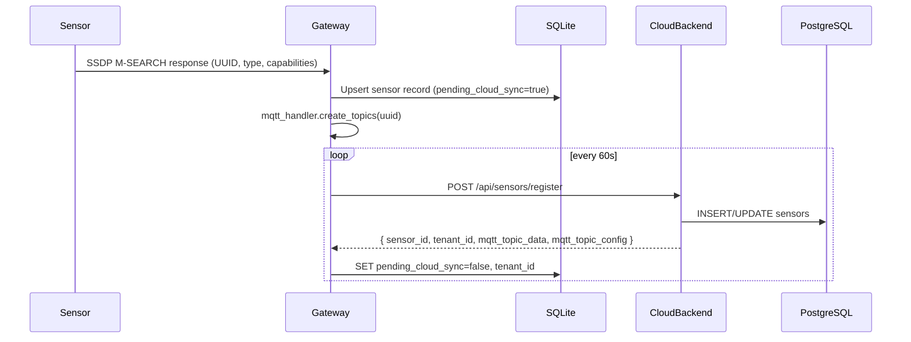
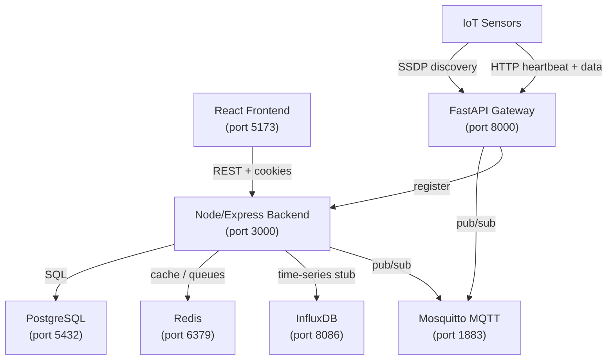
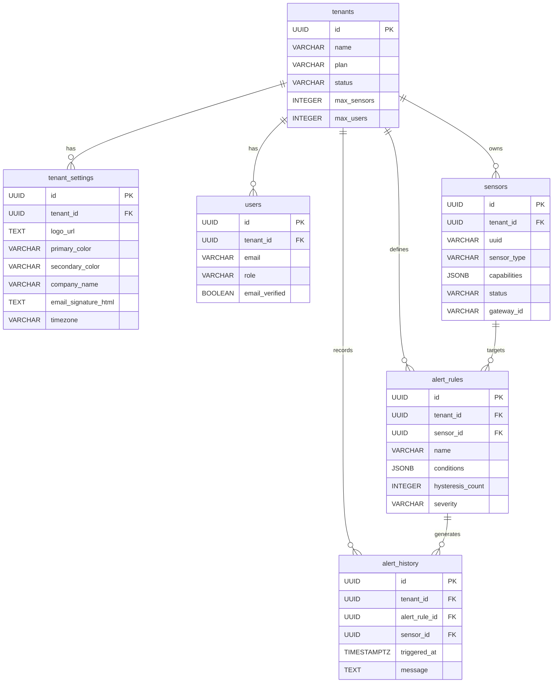

# EchoSmart Architecture

## System Overview

EchoSmart is a multi-tenant IoT greenhouse monitoring platform composed of four main layers: sensor devices, an edge gateway, a cloud backend, and a React frontend.

---

## 1. Auto-Discovery Flow



---

## 2. Microservices Architecture



---

## 3. Multi-Tenant Data Model



---

## 4. Tenant Isolation Strategy

- **Application layer**: `enforceTenantIsolation` middleware sets `req.tenantId` from the JWT. All DB queries include `WHERE tenant_id = $1`.
- **Database layer**: PostgreSQL Row Level Security (RLS) policies on all tenant-scoped tables read `app.current_tenant_id` session variable.
- **Superadmin bypass**: Superadmins may pass `tenantId` as a query parameter to operate across tenants.

---

## 5. Alert Rule Engine

Conditions are stored as JSONB trees supporting recursive `AND`/`OR`/`NOT` operators:

```json
{
  "operator": "AND",
  "conditions": [
    { "field": "temperature", "op": ">", "value": 30 },
    { "field": "humidity", "op": "<", "value": 20 }
  ]
}
```

Hysteresis prevents alert flapping – the condition must be true for N consecutive sensor readings before an alert is fired.
