# EchoSmart — Diagramas, Bocetos y Esquemas

Colección de diagramas técnicos de la plataforma **EchoSmart** renderizados con [Mermaid](https://mermaid.js.org/). Todos los diagramas se visualizan directamente en GitHub.

---

## Índice

1. [Arquitectura General (3 Capas)](#1-arquitectura-general-3-capas)
2. [Esquema de Base de Datos (ER)](#2-esquema-de-base-de-datos-er)
3. [Flujo de Lectura de Sensores (E2E)](#3-flujo-de-lectura-de-sensores-e2e)
4. [Flujo de Evaluación de Alertas](#4-flujo-de-evaluación-de-alertas)
5. [Flujo de Autenticación JWT](#5-flujo-de-autenticación-jwt)
6. [Arquitectura del Gateway (5 Capas)](#6-arquitectura-del-gateway-5-capas)
7. [Jerarquía de Tópicos MQTT](#7-jerarquía-de-tópicos-mqtt)
8. [Arquitectura de Componentes Frontend](#8-arquitectura-de-componentes-frontend)
9. [Infraestructura de Despliegue](#9-infraestructura-de-despliegue)
10. [Roadmap del Proyecto](#10-roadmap-del-proyecto)
11. [Conexiones de Sensores (Hardware)](#11-conexiones-de-sensores-hardware)
12. [Flujo de Generación de Reportes](#12-flujo-de-generación-de-reportes)

---

## 1. Arquitectura General (3 Capas)

Visión general de la arquitectura edge-to-cloud de EchoSmart: sensores → gateway → nube → clientes.

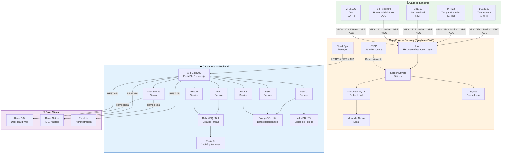

---

## 2. Esquema de Base de Datos (ER)

Diagrama entidad-relación del esquema PostgreSQL principal con soporte multi-tenant.

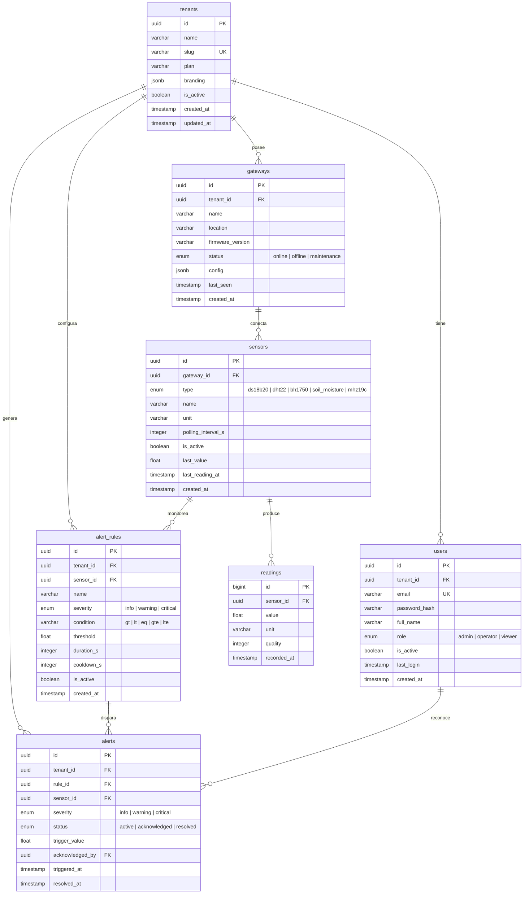

---

## 3. Flujo de Lectura de Sensores (E2E)

Secuencia completa desde la lectura física del sensor hasta la visualización en el dashboard.

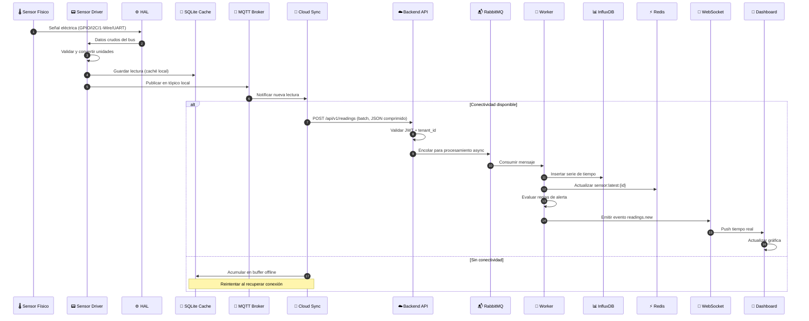

---

## 4. Flujo de Evaluación de Alertas

Máquina de estados del ciclo de vida de una alerta y el proceso de evaluación.

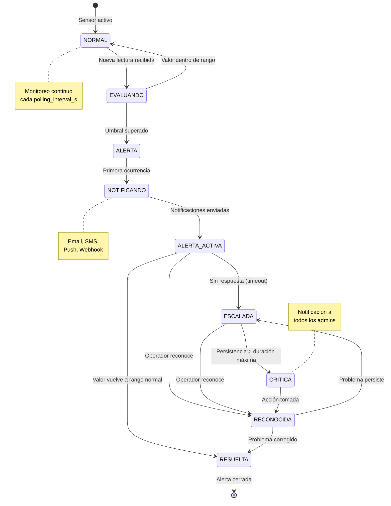

### Condiciones de Evaluación

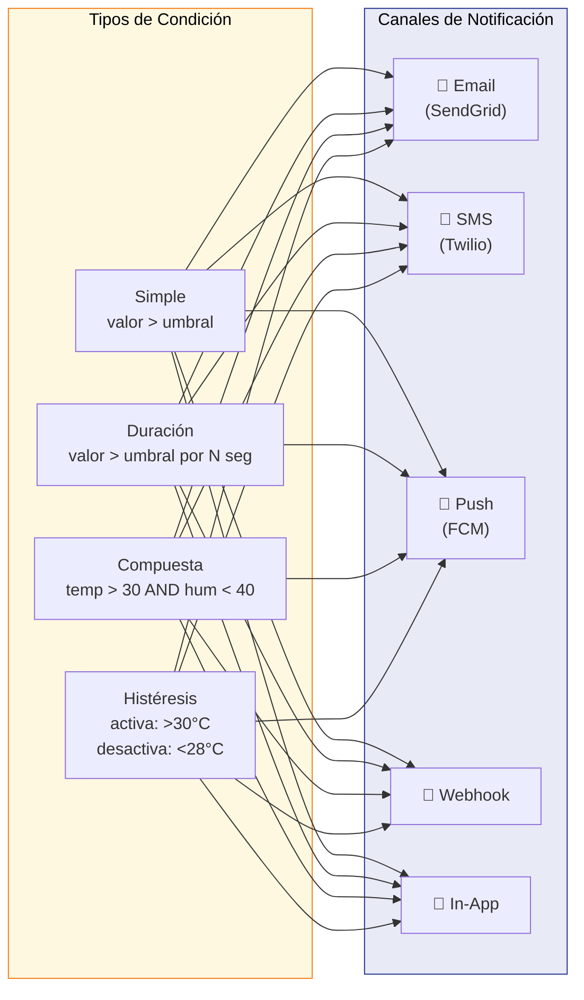

---

## 5. Flujo de Autenticación JWT

Secuencia de autenticación, autorización y refresco de tokens.

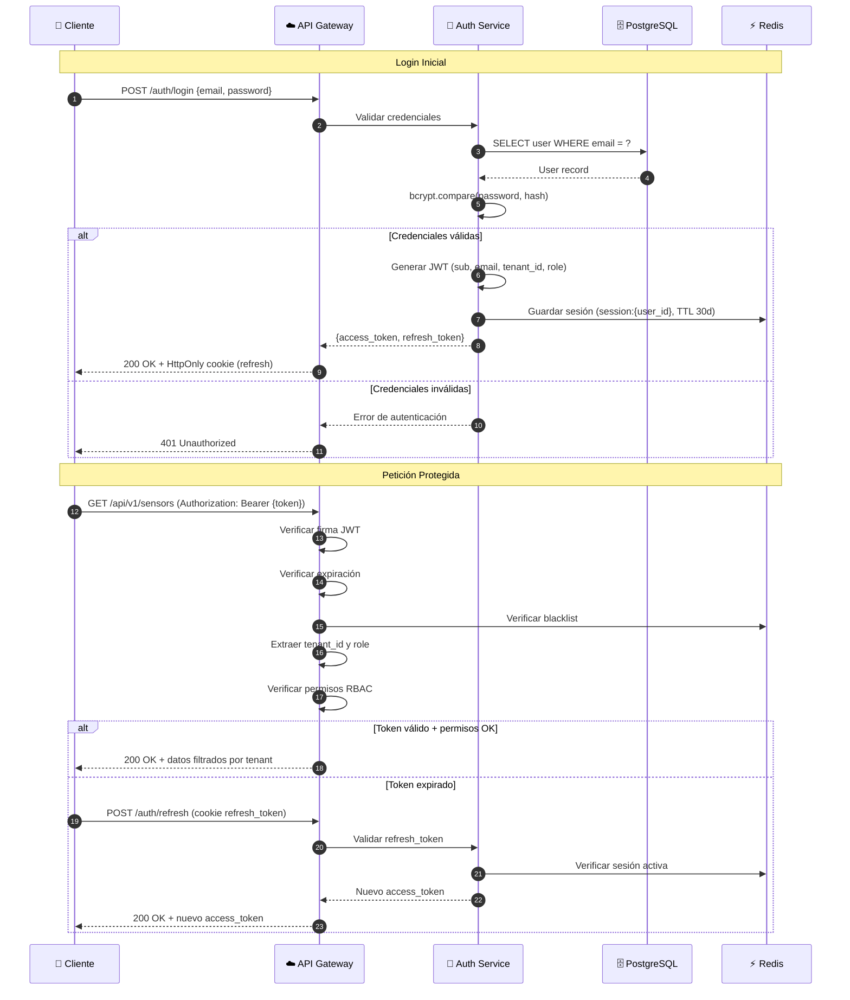

### Jerarquía RBAC

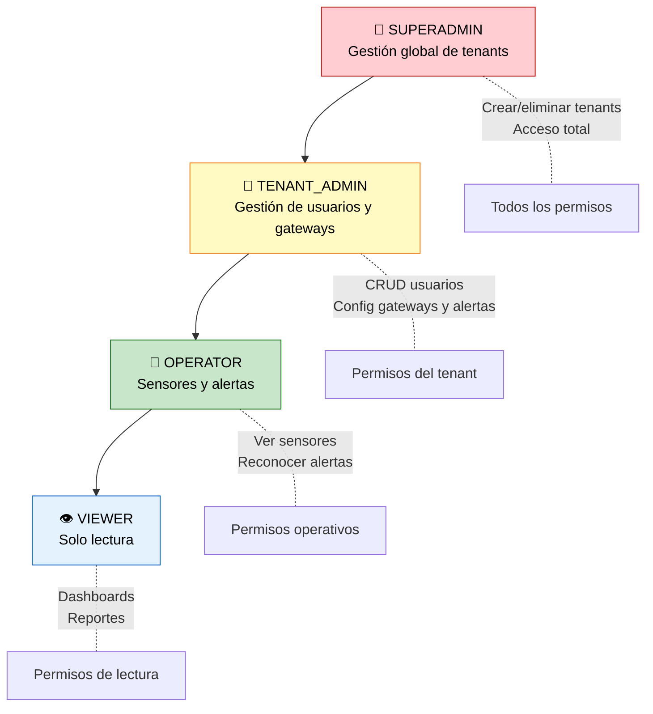

---

## 6. Arquitectura del Gateway (5 Capas)

Diagrama de la arquitectura de software del gateway (Raspberry Pi) con sus 5 capas funcionales.

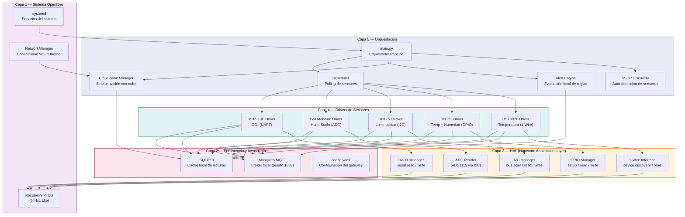

---

## 7. Jerarquía de Tópicos MQTT

Estructura de tópicos MQTT utilizados para la comunicación interna del gateway y hacia la nube.

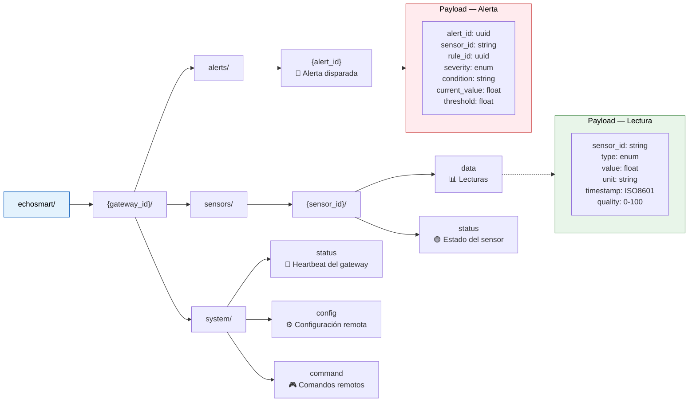

**Configuración MQTT:**

| Parámetro | Valor |
|-----------|-------|
| Protocolo | MQTT 3.1.1 |
| Broker | Mosquitto 2.0+ |
| Puerto local | 1883 |
| Puerto TLS | 8883 |
| QoS | 1 (al menos una vez) |
| Retain | Habilitado para status |

---

## 8. Arquitectura de Componentes Frontend

Estructura de componentes React y flujo de datos con Redux Toolkit.

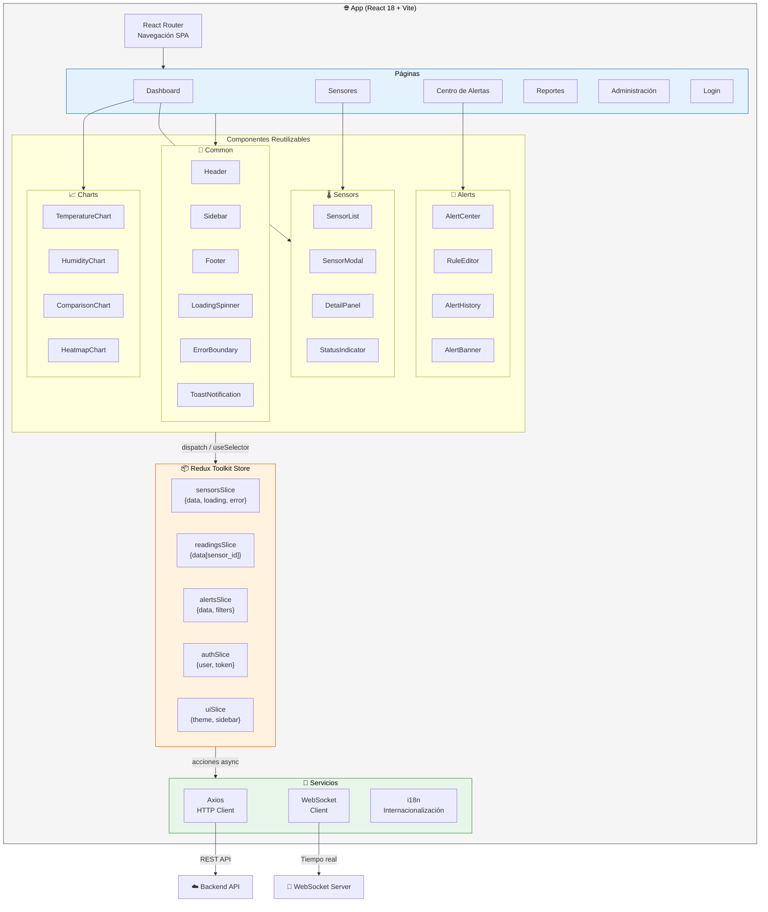

---

## 9. Infraestructura de Despliegue

Diagrama de la infraestructura de producción con Docker, Kubernetes y servicios cloud.

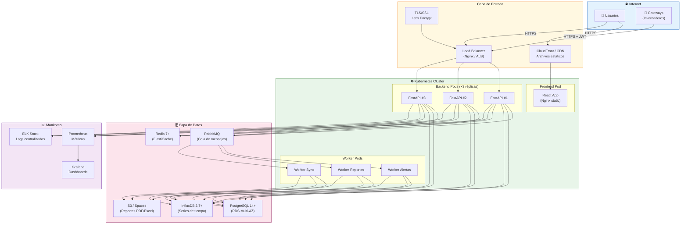

### Docker Compose (Desarrollo Local)

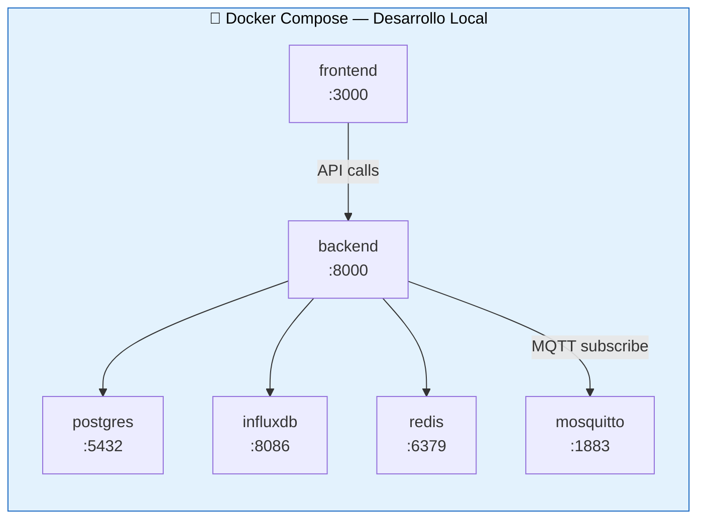

---

## 10. Roadmap del Proyecto

Línea de tiempo de las 5 fases de implementación de EchoSmart.

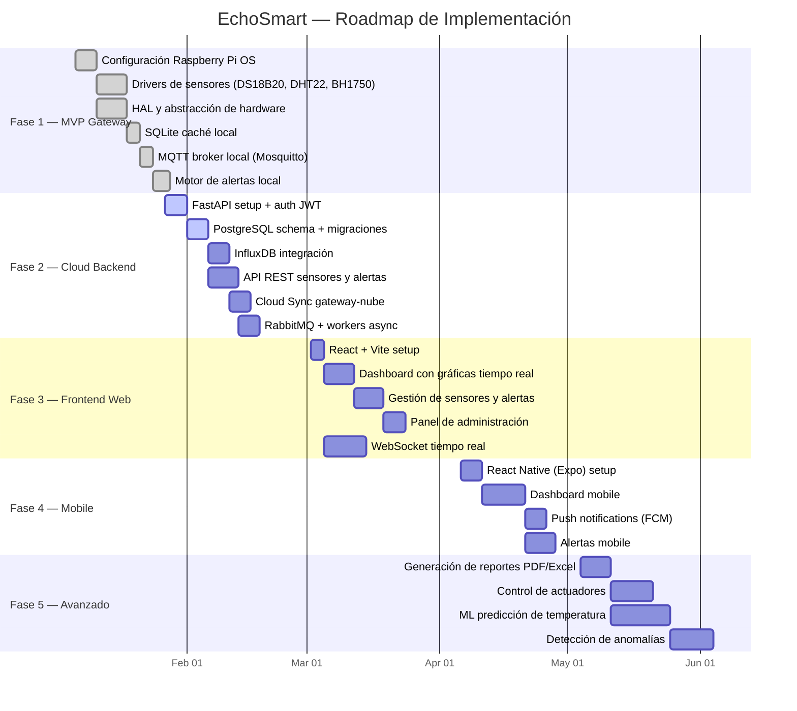

---

## 11. Conexiones de Sensores (Hardware)

Diagrama de conexiones físicas entre los sensores y la Raspberry Pi 4B.

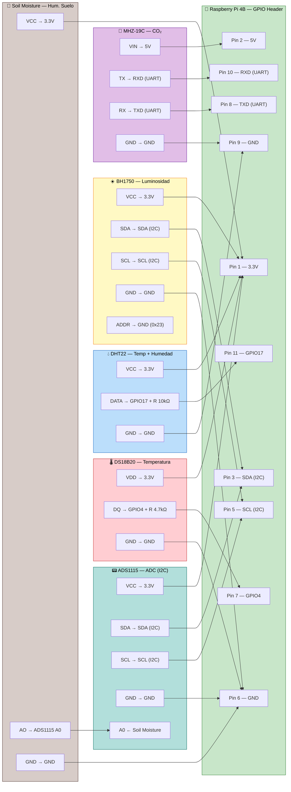

### Especificaciones de Sensores

| Sensor | Protocolo | Dirección | Rango | Precisión | Polling |
|--------|-----------|-----------|-------|-----------|---------|
| DS18B20 | 1-Wire | GPIO4 | -55°C a +125°C | ±0.5°C | 1s |
| DHT22 | GPIO | GPIO17 | -40°C a +80°C / 0-100% RH | ±0.5°C / ±2% | 2s |
| BH1750 | I2C | 0x23 | 1 – 65535 lux | ±1 lux | 1s |
| Soil Moisture | ADC (ADS1115) | 0x48 A0 | 0 – 100% | ±2% | 5s |
| MHZ-19C | UART | /dev/ttyS0 | 400 – 5000 ppm | ±50 ppm | 5s |

---

## 12. Flujo de Generación de Reportes

Secuencia del proceso asíncrono de generación de reportes PDF/Excel.

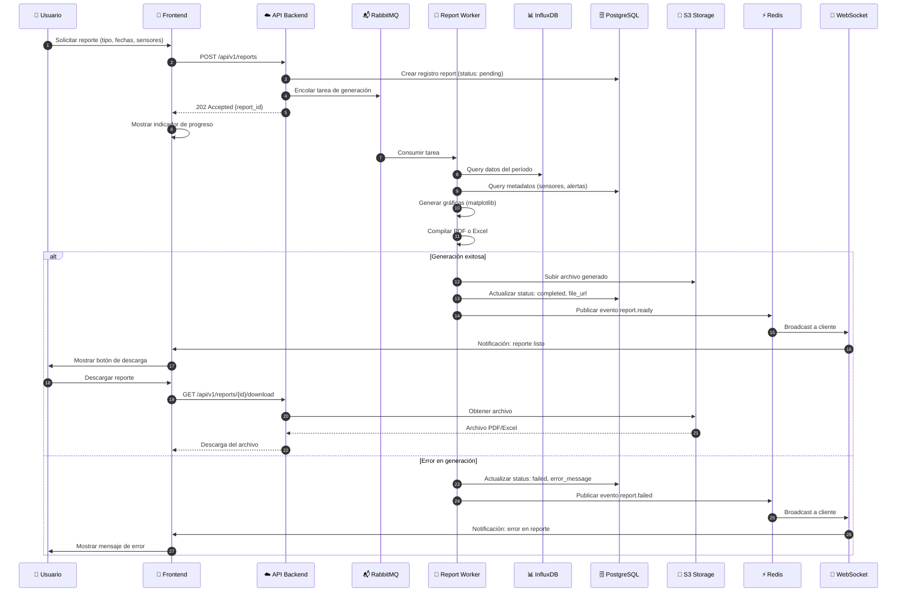

---

## Convenciones

- Todos los diagramas utilizan [Mermaid](https://mermaid.js.org/) y se renderizan nativamente en GitHub.
- Los colores siguen el esquema: 🟢 Edge/Gateway, 🔵 Cloud/Backend, 🟣 Frontend/Clientes, 🔴 Alertas/Errores, 🟡 Datos/Storage.
- Los diagramas complementan la documentación detallada disponible en los archivos individuales del directorio `docs/`.

---

*Última actualización: Marzo 2026 · EchoSmart Dev Team*
